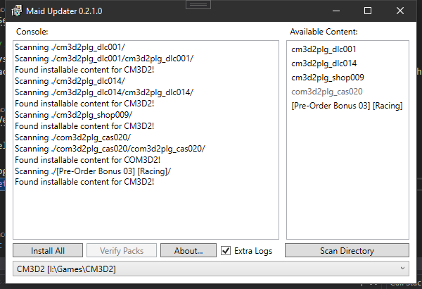

# ⬆️ Maid Updater
**Based on [this abandoned project](https://github.com/thepotatomaster/cm3d2-updater).**

### ⚠️ Use this tool at your own risk.
I've added several checks into the installation process to try to prevent your game from
getting bricked from a failed install, but there may be unexpected errors!
**Make a backup of your game install!**

# About
This is a tool that allows you to bulk install CM3D2 and COM3D2 updates and DLC packs.
It aims to completely replicate the behavior of the original updaters,
as well as giving you the ability to merge updates into a single pack.

# Changelog:
- v0.2: Added most functionality.
- v0.1: Initial release.

# License:
The person who wrote the original never put a license on it, and I doubt they care about the code anymore,
so I've licensed it as [MIT](https://choosealicense.com/licenses/mit/). If the original creator has problems
with that, feel free to reach out to me.

`Crc32.cs` and `SafeProxy.cs` are part of [Crc32.NET](https://github.com/force-net/Crc32.NET), used under 
[MIT](https://choosealicense.com/licenses/mit/) license.
